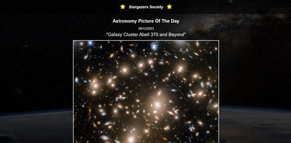
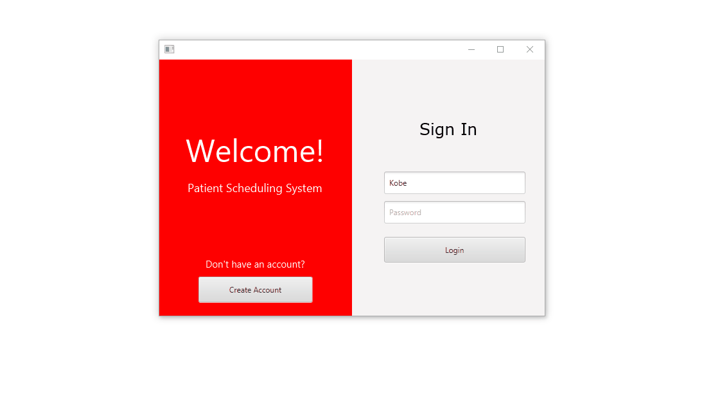

<h1 align="center">Hi 👋, I'm Brandon Diep</h1>
<h3 align="center">A passionate software engineer learning everyday and improving.</h3>

- 🌱 I’m currently learning **Node.js**

- 💬 Ask me about **HTML, CSS, JavaScript**

- 📫 How to reach me **brandondiep2711@gmail.com**

<h3 align="left">Connect with me:</h3>

<h3 align="left">Languages and Tools:</h3>

       

<h1 align="center">Projects</h1>
<table bordercolor="#66b2b2">
  
  <tr>
    <td width="50%" valign="top">
      <h3 align="center">Blossom Hair Salon</h3>
         
        
         
        

            
          
        

        
<strong>HTML5, CSS3, & Javascript</strong> - Blossom Hair Salon site debuting stylists, gallery of looks and services.

    </td>  
    <td width="50%" height="10%" valign="top">
      <h3 align="center">Mama's Recipes</h3>
         
      
         
        

          <a href="https://github.com/BrandonTDiep/mama-recipe" target="_blank">
            
          
        

        
<strong>HTML5, CSS3, & Javascript</strong> - Blossom Hair Salon site debuting stylists, gallery of looks and services.

    </td>    
  </tr>

  
  <tr>
    <td width="50%" valign="top">
      <h3 align="center">Stargazers Society</h3>
         
        
         
        

            
          
        

        
<strong>HTML5, CSS3, & Javascript</strong> - Stargazers Society site integrating NASA API APOD to display astronomy picture of the day and its description.

    </td>   
    <td width="50%" valign="top">
      <h3 align="center">Patient Scheduling System</h3>
         
        
         
        

            
<!--            -->
        

        
<strong>Java, SQL</strong> - A Patient Scheduling System helping patients create an account and schedule appointments.

    </td>     
  </tr>

         
</table>
